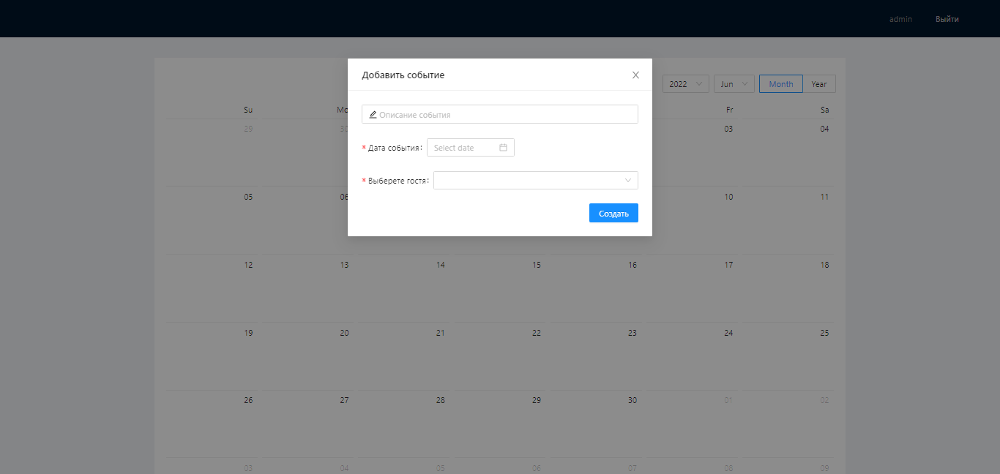

## Календарь событий

### Что использовалось при разработке?

<ul>
    <li><b>Design: </b>Ant-Design.</li>
    <li><b>Frontend: </b>ReactJS, TypeScript, Redux, React Router, Moment.</li>
    <li><b>Back end: </b>Local Api</li>
    <li>ECMAScript 6 (клиент и сервер).</li>
    <li>Webpack</li>
</ul>